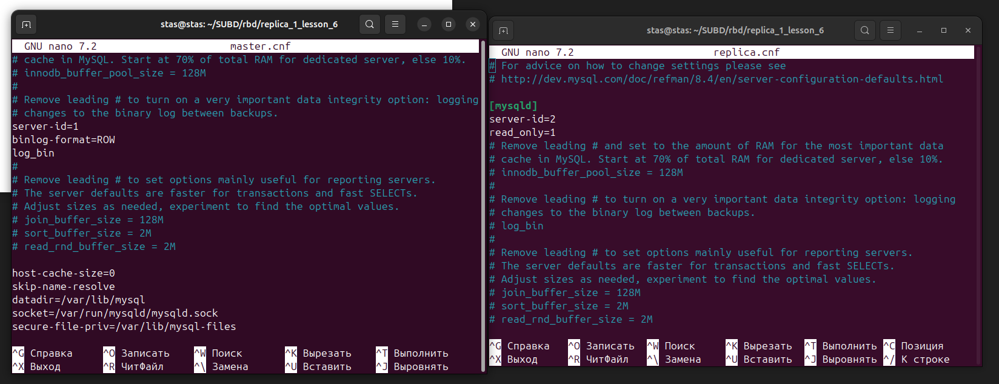

# Домашнее задание к занятию "`Репликация и масштабирование. Часть 1`" - `Кутейкин Станислав`

**ЗДРАВСТВУЙТЕ!**
---

### Задание 1

На лекции рассматривались режимы репликации master-slave, master-master, опишите их различия.

Ну главное различие, как бы это странно не звучало, в первую очередь в настройках, а если серьезно, то в мастер производится и запись и чтение, а в реплику только чтение, чтобы никто несанкционированно не внес туда данные она ставится только в режим read_only. В репликации master-master оба узла находятся в чтении-записи, но в этом и заключается их минус, что и на первый узел и на второй есть возможность записи данных, при этом надо настраивать синхронизацию данных.

---

---

### Задание 2

Разворачивал в докере, порядок такой был:
    1.Создал сеть сначала docker network create replication;  
    2. Далее поднял сразу контейнеры 2 с мастером и репликой:  
        docker run --name replica --net replication -d -e MYSQL_ROOT_PASSWORD=root mysql:8.4  
        docker run --name master --net replication -d -e MYSQL_ROOT_PASSWORD=root mysql:8.4  ;  
    3. Скопировал оттуда файлы настроек, отредактировал их на хосте и закинул обратно:
        docker cp master:/etc/my.cnf master.cnf  
        docker cp replica:/etc/my.cnf replica.cnf  
        docker cp master.cnf master:/etc/my.cnf  
        docker cp replica.cnf replica:/etc/my.cnf  ;  
    4. Создал на мастере пользователя для реплики, выдал права;  
    5. На реплике подключил реплику к мастеру;  
    6. Посмотрел статус реплики;  
    7. Создал на мастере таблицу, внес данные, првоерил на реплике данные и попробовал внести данные, не получилось из-за read-only настроек.  

Все на скриншотах 

1

2

3

4

5

6

---

---

### Задание 3

Тут почти тоже самое до пункта 4 предыдущего списка, за сиключением названия контейнеров:  
    4. Создал и на одном и на втором мастере пользователей для подключения, выдал права;  
    5. На одном и втором мастере подключил друг к другу;  
    6. Запустил и проверил статусы мастеров  
    7. Создал на первом базу и таблицу, внес данные, посмотрел данные на втором, внес даные на втором, посмотрел данные на первом.  

1

2

3

4

---

Для примера оставил 2 конфига master-1.cnf и master-2.cnf которые редактировал и копировал в контейнеры.

**СПАСИБО ЗА ПРОВЕРКУ!**